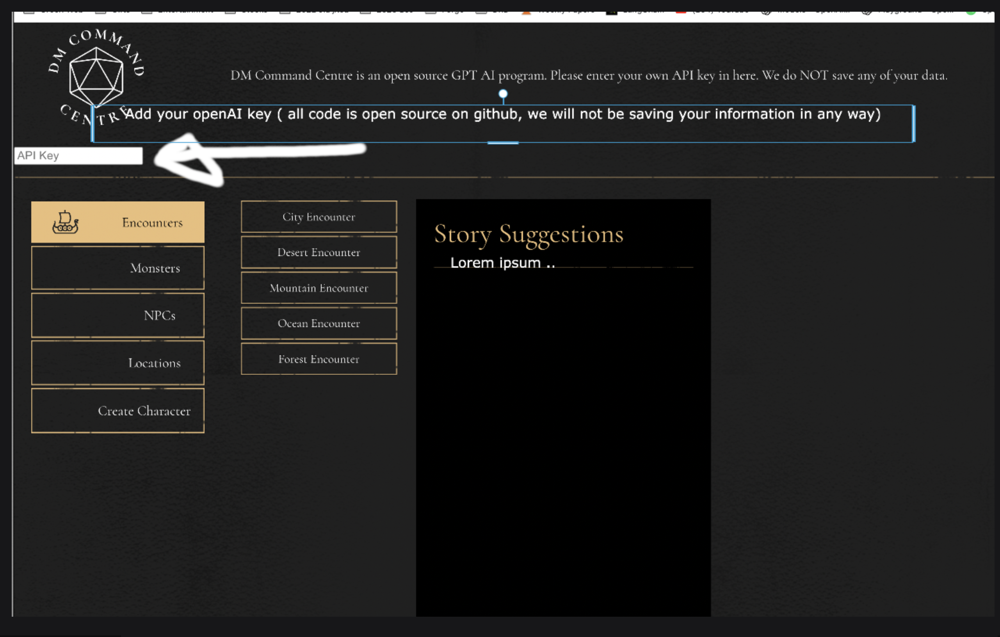
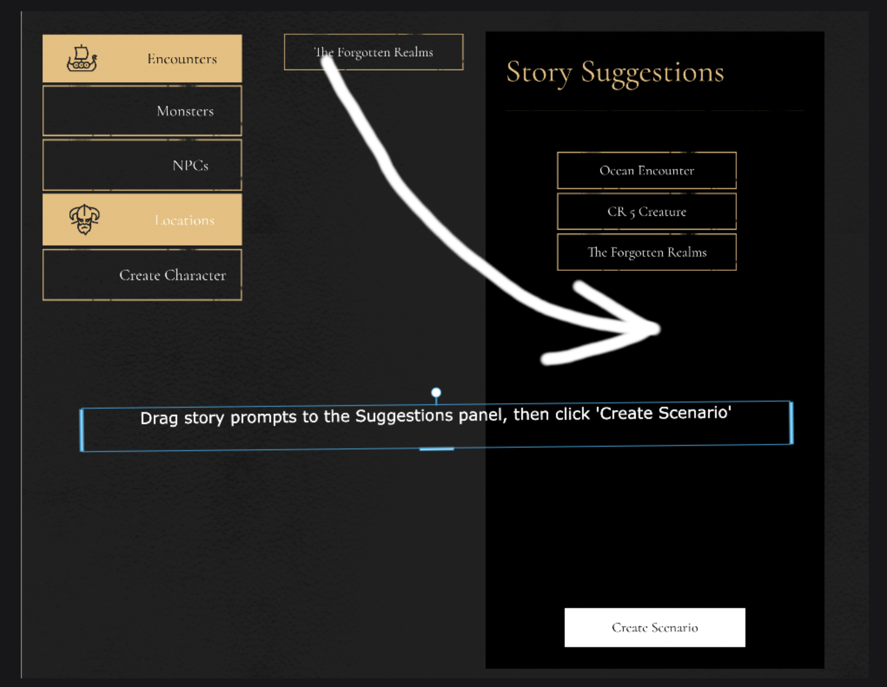
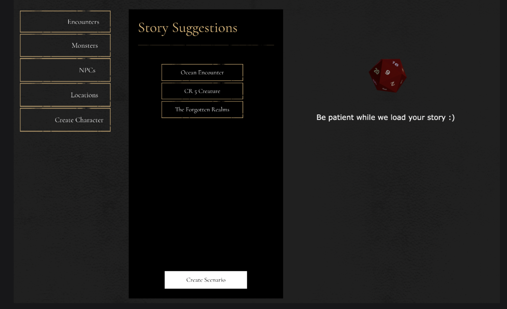
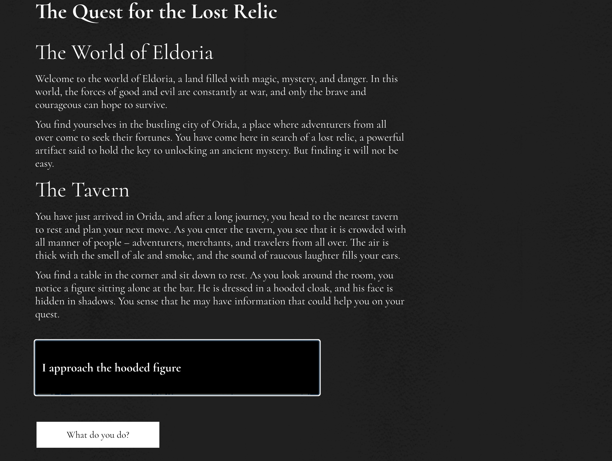

# DM Command Center

OpenAI, ChatGPT powered, stateful LLM storytelling application.

-view it live https://jazzy-cheesecake-2dd357.netlify.app/

DM Command Center is a React app designed to help Dungeon Masters (DMs) generate stories and manage their game sessions. It uses React for state management and contains hundreds of random options in JSON objects, scraped from various D&D websites online and summarized by Chat GPT separately. This app is an experiment in story generation and homemade memory.







## Installation

First, make sure you have Node.js installed on your system. Then, follow these steps to install and run the app:

1. Clone the repository to your local machine.
2. Navigate to the project directory in your terminal.
3. Run the following command to install the required dependencies:

```bash
npm install
```

4. Start the development server by running:

```bash
npm start
```

The app should now be running on your local machine. Open your browser and navigate to `http://localhost:3000` to access the app.

## Usage

Enter your openai api key in the top input
https://platform.openai.com/account/api-keys

Navigate between menus on the left, and drag items to the Story Suggestions box.
Each object contains a random index of data from large objects of relevant items
Drag and drop items into empty space to remove them, and replace them with a new random index
Once you have added your 'ingredients', click play and wait for your content to load.
Begin interacting with your new world!

The console provides a lot of information.

## Not working
Images and character creation arent really working yet, im not working on this repo atm, but if anyone has a suggestion id be delighted.


## Contributing

Contributions are welcome! If you have ideas for new features, improvements, or bug fixes, feel free to open an issue to discuss your ideas. If you'd like to contribute code, please fork the repository, make your changes, and submit a pull request.

When contributing, please ensure that you provide clear and concise descriptions of the changes you've made and update any tests or documentation as necessary.


## License

This project is licensed under the MIT License.

## Acknowledgements

This app was built before the I discovered Langchain and was inspired by the creativity and passion of the D&D community. A special thanks to all the D&D websites and resources that provided the content for this app. This readme was co-written by GPT-4.
